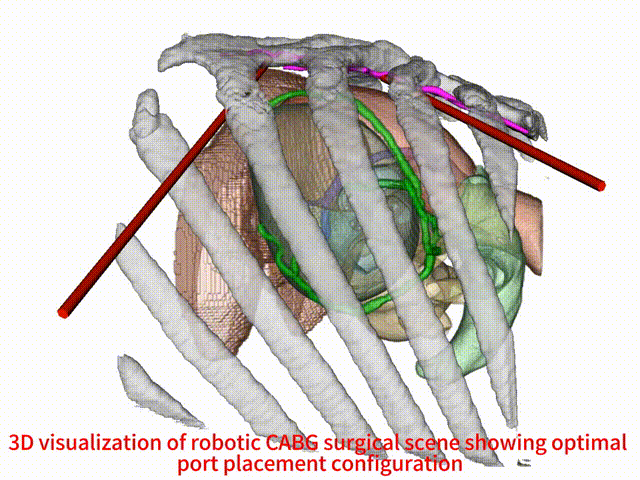

**Status:** ⚠️ **The complete code will be released upon paper acceptance** ⚠️

 # Dynamic Virtual Simulation with Real-time Haptic Feedback for Robotic Internal Mammary Artery Harvesting 

[Shuo Wang](https://orcid.org/0009-0008-6187-0401)<sup>1</sup>,
[Tong Ren](https://orcid.org/0009-0002-1929-8444)<sup>2</sup>,
[Nan Cheng]<sup>2</sup>,
[Rong Wang]<sup>2</sup>,
[Li Zhang](https://orcid.org/0000-0003-3633-9578)<sup>1*</sup>

<sup>1</sup>Tsinghua University, <sup>2</sup>The Six medical center of PLA General Hospital

[[Project](#)] [[Paper](assets/Dynamic Virtual Simulation with Real-time Haptic Feedback for Robotic Internal Mammary Artery Harvesting.pdf)] [[arXiv](https://www.preprints.org/manuscript/202502.0335)] [[Video](https://www.youtube.com/playlist?list=PL6KpB8HbHVTTqnfAiExECcJxQTmd1E16l)] [[Supp](#)]

This repository contains the official implementation of our paper "Dynamic Virtual Simulation with Real-time Haptic Feedback for Robotic Internal Mammary Artery Harvesting", submitted to bioengineering.

**Note:** 
- <span style="color: red">The complete code will be released upon paper acceptance.</span>

## Features
<p align="center">
  
</p>
- Topology-preserving cutting algorithm
<p align="center">
  
</p>
- Bidirectional tissue coupling mechanism
<p align="center">
  
</p>
- Dual-channel haptic feedback
<p align="center">
  
</p>
- Dynamic cardiac model integration
<p align="center">
  
</p>


## Requirements
### System Requirements
- Windows/Linux/MacOS
- OpenGL support
- C++ compiler with C++11 support

### Dependencies
- iMSTK (Interactive Medical Simulation Toolkit)
- VTK
- Eigen
- (Optional) Haptic device SDK

## Key Components


## Usage

## Important Notes
- Haptic device support is optional and controlled by `USE_HAPTICS` flag
- Performance depends on mesh resolution and solver parameters
- Real-time performance requires proper hardware support

## Citation
If you find our work useful in your research, please consider to cite our paper:
```

```


## Relevant Works

## Acknowledgement


